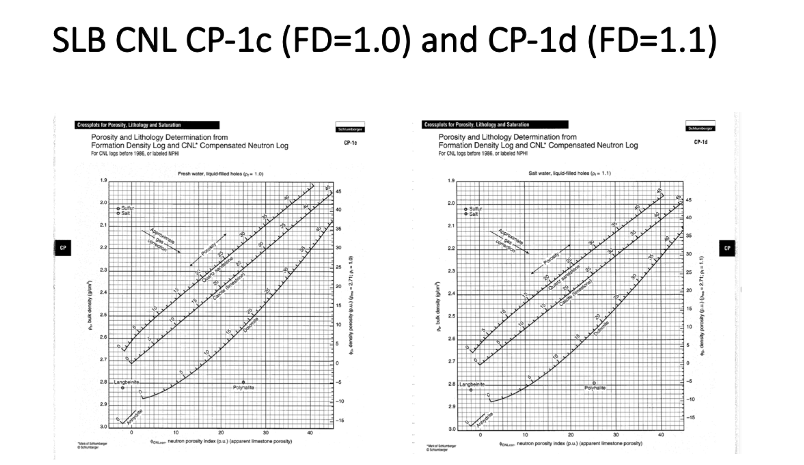
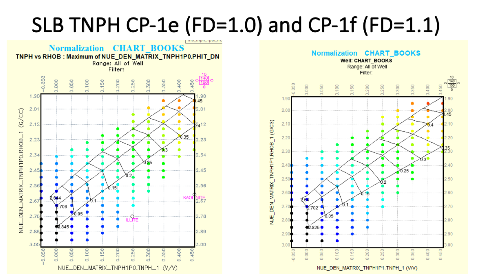

# Chart-Book_Neutron-Density-Porosity-using-KNN
The objective of this project is to calculate a Neutron-Density Cross-Plot log analysis total porosity using at this point the Schlumberger CNL or TNPH Charts and associated Neutron Porosity logs with either fresh or saline fluid densities. The Neutron logs should be on Limestone matrix. Constructive criticism and collaboration are welcome. 

The name of the Python code is NeutDen_chartbook_porosity_knn_testresults.py. This Python program uses a matrix of Neutron Porosity (V/V) vs. Bulk Density (G/CC) with known porosities as the training set. At this point we are using test data as our log data. We first normalize the Neutron Porosity and Bulk Density curves and then use a KNN of 3 to estimate Cross-Plot Porosity from our test data set.   

This program has been tested showing good agreement on our calculated porosities, but further testing should be conducted before using this program to better understand the uncertainties of the estimations and validate using a KNN of 3. Please provide feedback if you have any issues.

We are using CNL_1pt1_testdata.xls as log data at this point for testing purposes. You could use your own log data in lieu of this file to calculate Neutron-Density log analysis Total Cross Plot porosities.

We have 4 sets of data representing 4 of the Schlumberger charts; 2 fluid densities for CNL and 2 for TNPH. Other vendor charts can also be included as needed. 
